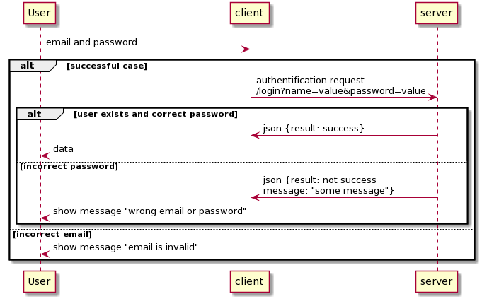
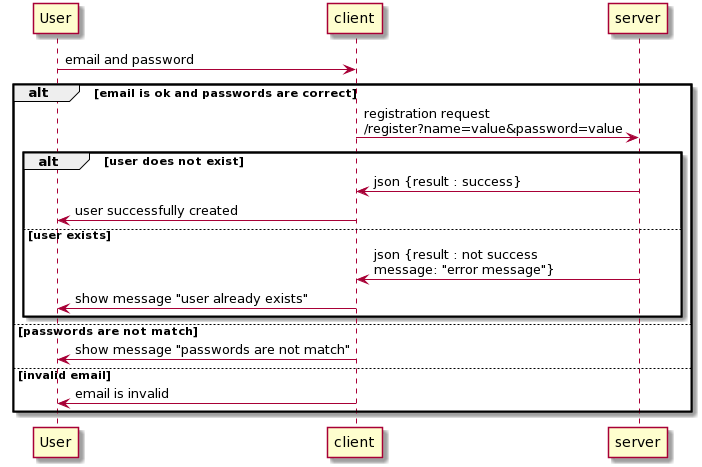
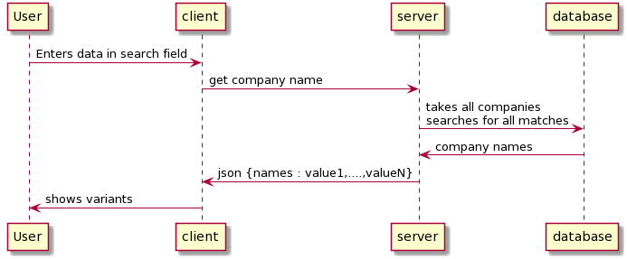

# USER
## Log in
Unauthorised user makes an attempt to enter into account.

### Algorithm
1. User click on a "Log in" button.
2. User inputs email and password and submits.
3. Server verifies that user exist.
4. Server sends user data.


```
@startuml
User -> client : email and password
alt successful case
    client -> server : authentification request\n/login?name=value&password=value

    alt user exists and correct password
        server -> client : json {result: success}
        client -> User : data
    else incorrect password
        server -> client : json {result: not success\nmessage: "some message"}
        client -> User : show message "wrong email or password"
    end

else incorrect email
    client -> User : show message "email is invalid"

end
@enduml
```




### Exceptions
* Wrong password
* Invalid email
* User doesnt exist

### API
method | request | response
--- | --- | --- |
GET /login?name=value&password=value | none | {result: success/not success, message: "error message"}
 
## Log On
Unauthorised user makes an attempt to make an account

### Algorithm
1. User click on a "Log on" button.
2. User inputs email, password, password again, and submits.
3. Server creates new user.
4. Server sends user data.

```
@startuml
User -> client : email and password
alt email is ok and passwords are correct 

    client -> server : registration request\n/register?name=value&password=value
    alt user does not exist
        server -> client : json {result : success}
        client -> User : user successfully created
    else user exists
        server -> client : json {result : not success\nmessage: "error message"}
        client -> User : show message "user already exists"
    end
else passwords are not match
    client -> User : show message "passwords are not match"
else invalid email
    client -> User : email is invalid
    
end
    
@enduml
```



### Exceptions
* Passwords are not match
* Invalid email
* User already exists

### API
method | request | response
--- | --- | --- |
GET /register?name=value&password=value | none | {result: success/not success message: "error message"}


## Search
User uses search input field.

### Algorithm
1. User enters some text to search field.
2. Client sends data to server.
3. Server gets data with the simular names.
4. Window with hints appears under the search field.

```
@startuml

User -> client : Enters data in search field
client -> server : get company name
server -> database : takes all companies\nsearches for all matches
database -> server : company names
server -> client : json {names : value1,....,valueN}
client -> User : shows variants 
    
@enduml
```


### Exceptions
No exceptions

### API
method | request | response
--- | --- | --- |
GET /search?name={name} | none | {names : [value1,...., valueN]}