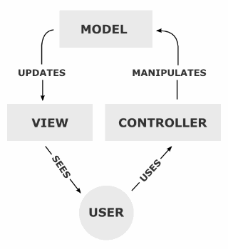
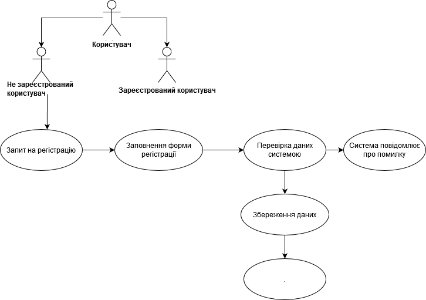
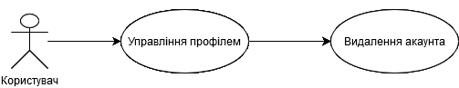
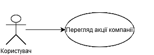
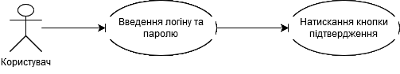
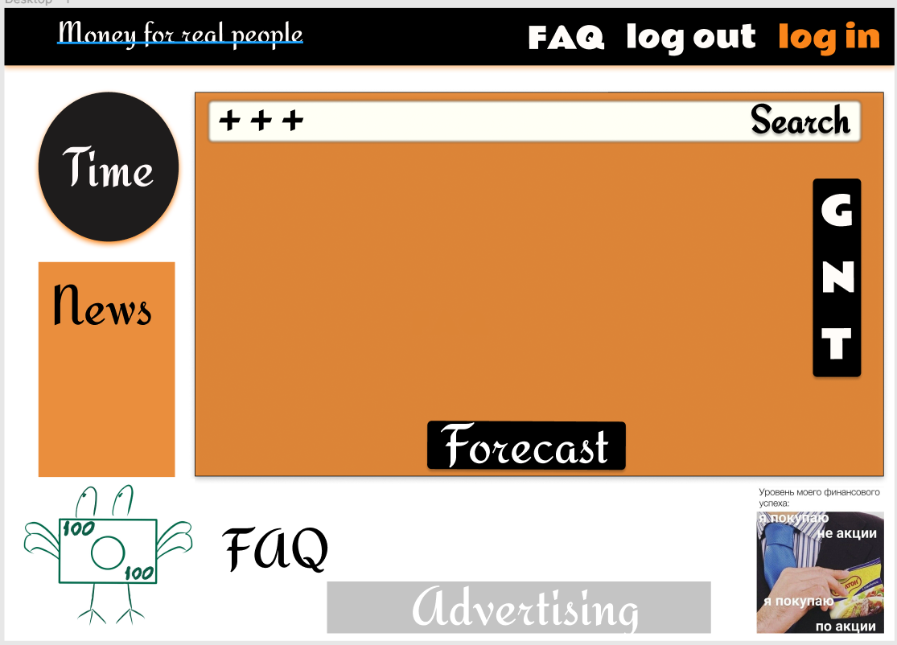

### Зміст
[Вступ](#Вступ)
1. [Огляд MVC](#Огляд-MVC)
    * [Загальний огляд](#Загальний-огляд)
    * [Історія](#Історія)
    * [Призначення](#Призначення)
    * [Концепція](#Концепція)
    * [Найчастіші помилки](#Найчастіші-помилки)
    * [Реалізація](#Реалізація)
        * [Java](#Java)
2. [Проектування програмного забезпечення](#Проектування-програмного-забезпечення)
    * [Use case](#Use-case)
        * [Реєстрація нового користувача](#Реєстрація-нового-користувача)
        * [Управління профілем](#Управління-профілем)
        * [Можливість перегляду прогнозу акцій різних компаній протягом певного періоду часу](#Можливість-перегляду-прогнозу-акцій-різних-компаній-протягом-певного-періоду-часу)
        * [Авторизація у системі](#Авторизація-у-системі)
    * [Проектування графічного інтерфейсу користувача](#Проектування-графічного-інтерфейсу-користувача)
        * [Макет графічного інтерфейсу](#Макет-графічного-інтерфейсу)
3. [Java Docs](https://github.com/MAXSSYPE/ipz_backend/tree/master/javadoc)

## **Вступ**
Об’єктом розробки даної курсової роботи є програма з функціональністю для управління сайтом для прогнозування акції компанії. 

Метою курсової роботи є закріплення теоретичних знань і практичних навичок з проектування, моделювання , розробки та тестування програмного забезпечення з графічним інтерфейсом.

## **Огляд MVC**
### ***Загальний огляд***
Модель-вид-контролер (або Модель-вигляд-контролер,  Модель-представлення-контролер  англ. Model-view-controller, MVC) — архітектурний шаблон, який використовується під час проектування та розробки програмного забезпечення.

Рис 1.1 Концепція  Model-View-Controller

Цей шаблон поділяє систему на три частини: модель даних, вигляд даних та керування. Застосовується для відокремлення даних (модель) від інтерфейсу користувача(вигляду) так, щоб зміни інтерфейсу користувача мінімально впливали на роботу з даними, а зміни в моделі даних могли здійснюватися без змін інтерфейсу користувача.

Мета шаблону — гнучкий дизайн програмного забезпечення, який повинен полегшувати подальші зміни чи розширення програм, а також надавати можливість повторного використання окремих компонентів програми. Крім того використання цього шаблону у великих системах призводить до певної впорядкованості їх структури і робить їх зрозумілішими завдяки зменшенню складності.

Дана схема проектування часто використовується для побудови архітектурного каркасу, коли переходять від теорії до реалізації в конкретній предметній області.

### ***Історія***
Концепція MVC була описана у 1979 році Трюгве Реенскауг (англ. Trygve Reenskaug), який тоді працював над мовою програмування Smalltalk в Xerox PARC. Оригінальна реалізація описана в статті «Applications Programming in Smalltalk-80: How to use Model-View-Controller». Потім Джим Алтоф з командою розробників реалізували версію MVC для бібліотеки класів Smalltalk-80.

В оригінальній концепції була описана сама ідея і роль кожного із елементів: моделі, представлення і контролера. Та зв’язки між ними були описані без конкретизації. Крім того, розрізняли дві основні модифікації:

1. Пасивна модель – модель не має ніяких способів впливу на представлення чи контролер і використовується ними в якості джерела даних для відображення. Всі зміни моделі відстежуються контролером і він же відповідає за перемальовування представлення, якщо це необхідно. Така модель частіше всього використовується в структурному програмуванні, оскільки у цьому випадку модель являє собою просто структуру даних, без методів їх обробки.
2. Активна модель – модель сповіщає представлення про те, що в ній виникли зміни, а представлення, які зацікавленні в сповіщенні, підписуються на ці сповіщення. Це дозволяє зберегти незалежність моделі як від контролера, так і від представлення. 

Класичною реалізацією концепції MVC вважають версію з активною моделлю. 

Із розвитком Об’єктно-орієнтованого програмування і поняття про шаблони проектування був створений ряд модифікацій концепції MVC, які при реалізації у різних авторів можуть відрізнятися від оригінальної. Так, наприклад, Еріан Вермі в 2004 році писав приклад узагальненого MVC.

### ***Призначення***
Основна мета використання цієї концепції у розділенні бізнес-логіки(моделі) від її візуалізації(представлення, вигляду). За рахунок такого розмежування підвищується можливість повторного використання. Найбільш корисне застосування даної теорії у тих випадках, коли користувач повинен бачити ті ж самі дані одночасно у різних контекстах та/або з різних точок зору. Виконуються наступні задачі:

1. До однієї моделі можна приєднати декілька видів, при цьому на чіпаючи реалізацію моделі. Наприклад, деякі дані можуть бути одночасно представлені у вигляді електронної таблиці, гістограми і кругової діаграми.
2. Не чіпаючи реалізацію вигляду, можна змінити реакції на дії користувача(натиснення мишкою на копку, введення даних), для цього достатньо використовувати інший контролер.
3. Ряд розробників спеціалізуються лише в одній із областей: або розробляють графічний інтерфейс, або розробляють бізнес-логіку. Тому можливо досягнути того, що програмісти, які займаються розробкою бізнес-логіки(моделі), взагалі не будуть обізнані в тому, яке представлення використовуватиметься.

### ***Концепція***
Концепція MVC дозволяє розділити дані, представлення і обробку дій користувача на три окремих компоненти:
1. Модель(англ. Model) Модель представляє інформацію: дані і методи роботи з цими даними, реагує на запити, змінюючи свій стан. Не містить інформації, про те, як ці знання можна візуалізувати.
2. Представлення, вигляд (англ. View). Відповідає за відображення інформації(візуалізацію). Часто в якості представлення виступає форма(вікно) з графічними елементами.
3. Контролер (англ. Controller). Забезпечує зв’язок між користувачем і системою: контролює введення даних користувачем і використовує модель і представлення для реалізації необхідної реакції, керує компонентами, отримує сигнали у вигляді реакції на дії користувача, і повідомляє про зміни компоненту Модель.

Така внутрішня структура в цілому поділяє систему на самостійні частини і розподіляє відповідальність між різними компонентами.

Важливо зазначити, що як представлення, так і контролер залежать від моделі. Однак модель не залежить ні від представлення, ні від контролера. Тим самим досягається призначення такого розмежування: воно дозволяє будувати модель незалежно від візуального представлення, а також створювати декілька різних представлень для однієї моделі

Для реалізації схеми Model-View-Controller використовується достатньо велике число шаблонів проектування(в залежності від складності архітектурного рішення), основні з яких стратегія, композит, спостерігач.

Найбільш типова реалізація відділяє вигляд від моделі шляхом встановлення між ними протоколу взаємодії, використовуючи апарат подій(підписка/сповіщення). При кожній зміні внутрішніх даних в моделі вона сповіщає всі залежні від неї представлення і представлення обновлюється. Для цього використовують шаблон спостерігач. При обробці реакції користувача вигляд обирає, в залежності від потрібної реакції, потрібний контролер, який забезпечує той чи інший зв’язок з моделлю. Для цього використовується шаблон стратегія, або замість цього може бути модифікація із використанням шаблону команда. А для можливості однотипної роботи з підоб’єктами складно-скомпонованого ієрархічного виду може використовуватись шаблон композит. Крім того, можуть використовуватись і інші шаблони проектування, наприклад, фабричний метод, який дозволить задати за замовчуванням тип контролера для відповідного виду.

### ***Найчастіші помилки***
Програмісти-початківці (особливо в веб-програмуванні, де абревіатура MVC стала популярною) дуже часто трактують архітектурну модель MVC як пасивну модель MVC. У цьому випадку модель виступає виключно сукупністю функцій для доступу до даних, а контролер містить бізнес логіку. В результаті код моделі по факту являється засобом для отримання даних із СУБД, а контролер являє собою типовий модуль, наповнений бізнес-логікою, або скрипт у термінології веб-програміста. В результаті такого розуміння MVC розробники стали писати код, який Pádraic Brady, відомий у колах спільноти Zend Framework, охарактеризував як ТТПК – «Товсті тупі потворні контролери» (Fat Stupid Ugly Controllers)

Середньостатистичний ТТПК отримував дані із БД (використоруючи рівень абстракції бази даних, враховуючи, що ще модель) або маніпулював, перевіряв, записував, а також передавав дані у вигляд. Такий підхід став дуже популярним тому, що використання таких контролерів схоже на класичну практику використання окремого php-файлу для кожної сторінки додатку.

Але в об’єктно-орієнтованому програмуванні використовується активна модель MVC, де модель – це не тільки сукупність коду доступу до даних і СУБД, але і вся бізнес логіка. Варто зазначити про можливості моделі інкапсулювати в собі інші моделі. В свою чергу контролери являють собою лише елементи системи, в безпосередні обов’язки яких входить прийом даних із запиту і передача їх іншим елементам системи. Тільки у цьому випадку контролер стає «тонким» і виконує виключно функції зв’язкової ланки(glue layer) між певними компонентами системи.

### ***Реалізація***
Концепція MVC вперше застосувалася при проектуванні мови програмування Smalltalk як модель для інтерфейсу користувача . Також в область застосування концепції входить реалізація каркаса Документ-Вид (Document-View) в рамках бібліотеки MFC для мови Visual C++ . У сучасних технологіях концепція MVC представлена схемою JSP Model 1/2 для динамічної обробки Web-змісту на основі Java Server Pages (JSP).

### ***Java***
У мові програмування Java концепція MVC підтримується на рівні стандартних класів-бібліотек. В результаті використання парадигми MVC програміст отримує в своє розпорядження могутню структуру об'єктів-компонентів, функції яких чітко розмежовані, що гарантує надійність і розширюваність системи, що розробляється.
* Веб-каркаси: Struts, WebWork/Struts 2, Spring MVC, JavaServer Faces (JSF), Tapestry
* Десктоп-каркаси: Swing, JFace

## **Проектування програмного забезпечення**
### ***Use case***
#### ***Реєстрація нового користувача***
Користувач реєструється самостійно, заповнюючи реєстраційну форму на веб-сайті, вводить усі необхідні дані (логін, пароль, підтвердження паролю). Реєстрація завершується підтвердженням сервером про створення акаунта.

1. На головній сторінки веб-сайту потрібно натиснути кнопку «Реєстрація», у вікні зявиться реєстраційна форма
2. Ввести персональні дані у реєстраційну форму, натиснути кнопку «Зареєструвати»
3. Реєстрація завершується перевіркою введених даних сервером та створенням акаунта.

#### ***Управління профілем***
**Передумови**: користувача ідентифіковано та авторизовано

**Сценарій**:
1. На веб-сторінці натиснути кнопку "Account"
2. Обрати пункт "Delete account"
+ Висвічується діалогове вікно для підтвердження намірів видалення профілю
+ Користувач підтверджує або скасувує видалення

#### ***Можливість перегляду прогнозу акцій різних компаній протягом певного періоду часу***
**Передумови**: користувача ідентифіковано та авторизовано

**Сценарій**:
1. На веб-сторінці в розділі пошуку ввести назву команії, чиї акції цікавлять користувача 
2. Подивитися аналіз даних
3. За бажанням продивитися акції інших компаній

#### ***Авторизація у системі***
**Передумови**: користувач зареєстрований
1. Відкрити вікно програми
2. Ввести логін і пароль у відповідні поля
3. Натиснути кнопку "Увійти"

### ***Проектування графічного інтерфейсу користувача***
#### ***Макет графічного інтерфейсу***

